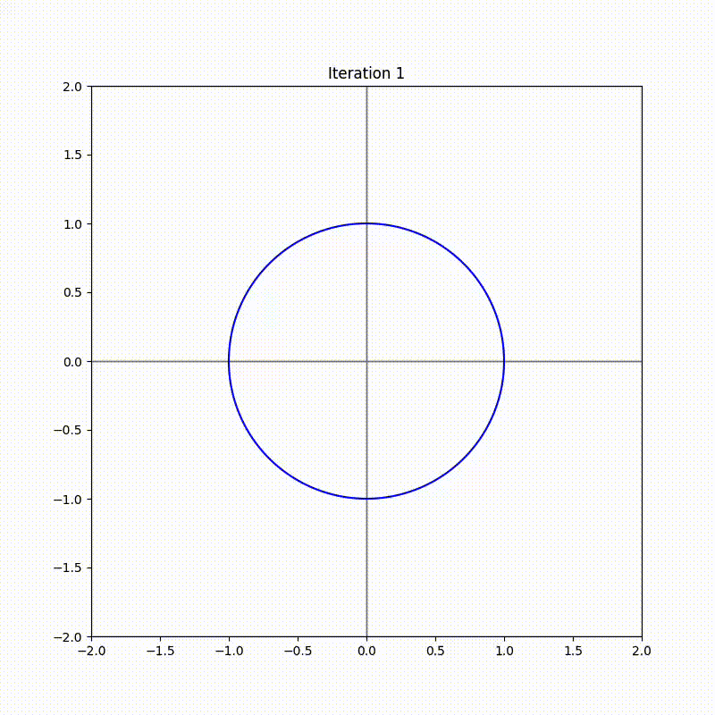

# Bound_df

Finds a lower bound of df on the real algebraic variety M = Z(f).

The file boundDF_summary contains the main code. The file Bound_df_with_examples contains some executions to see how each function works and the file bound_df_3D computes a lower bound on df on M for f a polynomial in 3 variables.

