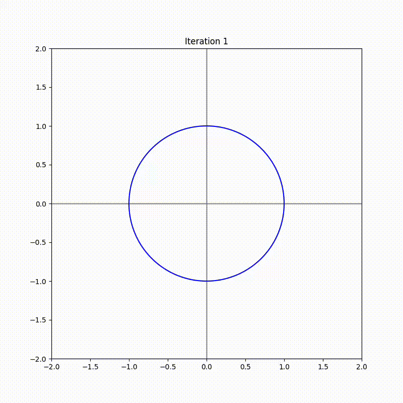

# Bound_df

Finds a lower bound of df on the real algebraic variety M = Z(f). Code pertaining to the preprint [https://arxiv.org/abs/2505.08427](https://arxiv.org/abs/2505.08427).
Here are the relevant files in the repository:

* Folder `benchmarks`: run these Python and Julia files to compare different algorithms on a range of example varieties.
